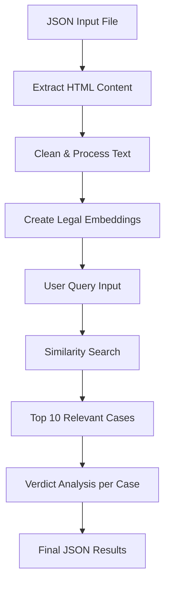

# Legal Case Analysis System

This system processes legal case data from JSON files, creates embeddings, performs similarity searches, and analyzes case verdicts to help you understand legal precedents relevant to your situation.

## Features

✅ **HTML Content Processing**: Automatically extracts and cleans HTML judgment text  
✅ **Legal Embeddings**: Uses specialized `law-ai/InLegalBERT` model for legal text  
✅ **Similarity Search**: Finds top 10 most relevant cases based on your query  
✅ **Verdict Analysis**: Determines who won each case (WIN/LOSS/UNCLEAR)  
✅ **Context-Aware**: Considers your specific legal situation  
✅ **JSON Output**: Structured results for further analysis  

## Quick Start

### 1. Prepare Your Data
Ensure your `output.json` file has the structure:
```json
{
  "research_materials": {
    "cases": [
      {
        "docid": 12345,
        "title": "Case Title",
        "court": "Court Name", 
        "date": "YYYY-MM-DD",
        "doc_data": {
          "doc": "<html>...judgment content...</html>"
        }
      }
    ]
  }
}
```

### 2. Run Analysis

**Simple Method:**
```bash
python run_legal_analysis.py
```

**Customized Method:**
Edit the configuration in `run_legal_analysis.py`:
```python
USER_QUERY = "your legal problem here"
USER_CONTEXT = "your specific situation"
TOP_CASES = 10  # number of cases to analyze
```

### 3. View Results
Check `legal_analysis_results.json` for complete analysis including:
- Case rankings by relevance
- Verdict analysis (WIN/LOSS/UNCLEAR)
- Detailed legal reasoning
- Summary statistics

## System Workflow



## Configuration Options

You can modify these settings in the code:

- **Embedding Model**: `law-ai/InLegalBERT` (specialized for legal text)
- **LLM Model**: `gemini-2.5-flash-preview-09-2025` (for verdict analysis)
- **Top Cases**: Number of most relevant cases to analyze (default: 10)
- **Database Path**: Where embeddings are stored (default: `./legal_case_db`)

## Understanding Results

### Verdict Classifications
- **WIN**: The plaintiff/petitioner won the case
- **LOSS**: The defendant/respondent won the case  
- **UNCLEAR**: Could not determine clear winner from the analysis

### Similarity Scores
Higher similarity scores indicate more relevant cases to your query.

### Output Structure
```json
{
  "user_query": "Your search query",
  "user_context": "Your situation context",
  "total_cases_analyzed": 10,
  "verdict_summary": {
    "wins": 3,
    "losses": 6, 
    "unclear": 1
  },
  "cases": [
    {
      "rank": 1,
      "doc_id": "123456",
      "title": "Case Name",
      "court": "High Court",
      "date": "2015-08-20", 
      "verdict": "WIN",
      "analysis_summary": "Brief analysis..."
    }
  ]
}
```

## Advanced Usage

### Using the Enhanced Embedding Module

```python
from strategist_workflow.embedding import analyze_legal_cases, save_analysis_results

# Run analysis
results = analyze_legal_cases(
    json_file_path="output.json",
    user_query="breach of contract for delayed delivery",
    user_context="I am a buyer seeking damages",
    top_k=10
)

# Save results
save_analysis_results(results, "my_analysis.json")
```

### Customizing Verdict Analysis

The system uses an improved query for verdict analysis:
```python
verdict_query = '''
Who won this case? What was the final judgment and ruling? 
Which party prevailed and what was decided in favor of whom? 
What was the court's decision regarding the plaintiff and defendant?
What relief was granted or denied? Who was the successful party?
'''
```

## Troubleshooting

### Common Issues

1. **Missing Dependencies**:
   ```bash
   uv add beautifulsoup4 lxml
   ```

2. **No Cases Found**: Check that your JSON has the correct structure with `research_materials.cases`

3. **Unclear Verdicts**: The system may need more context or the case judgment may be ambiguous

4. **API Errors**: Ensure you have proper internet connection for the Gemini API

### Performance Tips

- For large case collections (>100 cases), consider running in smaller batches
- The first run will be slower due to model loading and embedding creation
- Subsequent runs with the same embeddings database will be faster

## File Structure

```
eudia/
├── output.json                    # Input: Your legal cases
├── run_legal_analysis.py         # Main script to run
├── legal_analysis_results.json   # Output: Analysis results
├── strategist_workflow/
│   └── embedding.py              # Enhanced embedding functions
└── legal_case_db/                # ChromaDB storage
    └── chroma.sqlite3
```

## Example Use Cases

1. **Contract Disputes**: Find similar cases involving breach of contract
2. **Damages Assessment**: See how courts ruled on similar damage claims
3. **Legal Precedent Research**: Identify relevant precedents for your case
4. **Case Strategy Planning**: Understand likely outcomes based on similar cases

## Next Steps

1. Run the analysis with your specific query
2. Review the top cases and their verdicts
3. Read the detailed analysis for insights
4. Use the findings to inform your legal strategy

For questions or issues, check the code comments or modify the configuration parameters to suit your specific needs.